<!--
title: HIP Explorer
module_id: hip_explorer
author:   Thorsten Müller
createdAt: 2021-12-23T08:19:20.284Z
courseId: SnwEb9zji8P0azXWalkZoW8sSN1n2VEq
version:  1.0.0
language: DE
mode: continuous
icon: Left_upper_corner.jpg
toc: left
toc: false
link: helvetia.css
comment: Einführungskurs zur Helvetia Integration Platform (HIP).
estimated_time_in_minutes: 120
sharing: false

@flip_card

  

    

      @0
    

    

    <lia-keep>
      @1
      </lia-keep>
    

  

@end
-->

<!-- EGYEDI BAL OLDALI TOC -->

  
<a href="#section1">1. Introduction</a>

  
<a href="#section2">2. Market Overview</a>

  
<a href="#section3">3. Technology Drivers</a>

# Introduction

Introduction video

This introduction video summarizes the fundamental concepts behind Helvetia Integration Platform (HIP).  
The video outlines the idea behind the HIP Academy Learning Paths and how you, as a learner, can further progress your journey.

<iframe src="scorm_wrapper.html" style="width:100%; height:600px; border:none;"></iframe>

---

# Why is the Helvetia Integration Platform needed?

Why is the Helvecia Integration Platform needed?
  

The need for an integration platform such as HIP derived from two transformations, one affecting our business, the other the software industry.
  

The first transformation is in relation to the objectives of Helvetia as an organization. These objectives have shifted to:
  

  <ul>
    <li>improve customer experience</li>
    <li>become data driven</li>
    <li>accelerate software delivery</li>
    <li>while optimizing costs.</li>
  </ul>

  

Second, in the last decade, new practices emerged on how enterprise software is built, shipped and operated. Cloud Computing, Containers, Container Orchestration and Microservices enable us today to build and operate complex distributed systems with significantly less effort. Within this bubble of new and exiting technologies and practices, an integration platform like HIP takes a central role in enabling and facilitating the exchange of data between software systems.
  

Helvetia Integration Platform is a cornerstone technology within the Helvetia service portfolio, capable of bridging the gap between business demand and the capabilities of the software delivery departments.
   

Organizational Goals

The requirements are derived from market and technology drivers, the business units and IT's own requirements.

  <input type="radio" name="tabs" id="tab1" checked hidden>
  <input type="radio" name="tabs" id="tab2" hidden>
  <input type="radio" name="tabs" id="tab3" hidden>

  

    

      <label for="tab1">MARKET AND TECHNOLOGY DRIVERS</label>
      <label for="tab2">BUSINESS REQUIREMENTS</label>
      <label for="tab3">IT'S INTRINSIC CLAIM</label>
    

    

      

        
Market situation

        The insurance market is in a state of flux, both in Switzerland and in Europe. Our segments are subject to increasing substitutability compared with the market as a whole.
        
Technologies

        New technologies and trends such as analytics, artificial intelligence or cloud computing offer great potential and are becoming the new industry standard. 
          
      

      

        
Customers and Partners

        Customers' expectations are constantly changing. So are their demands on digital offerings and interactions.
        
Business Units and Country Markets

        The business units are consistently aligning themselves with the new market and customer requirements (e.g. convenience, omnichannel capability). Cost pressure is increasing. Current IT services must be reviewed for relevance and cost. 
          
      

      

        
Strengthening the Foundations

        IT identifies technological dependencies, reduces complexity, optimizes the use of resources and defines the strategic investment priorities together with the business.
        
Increasing Future Viability

        IT brings innovative and secure solutions to Helvetia that enable technology-based differentiation in the market and inspire customers and partners. 
          
      

    

  

  

  

    

      

      
"Our ambition is to be the driver of Helvetia’s digital transformation through customer-centric, innovative and cost-efficient IT services, along with new strategic thrusts:  
      Specifically, we are focusing on better orchestrating our service delivery, strengthening our integration and partnership capabilities, our front-end differentiation potential, expanding our analytics capabilities, optimizing IT processes, security, IT innovation management, and increasing our employer attractiveness."  

      *Achim Baumstark - CTO*

    

  

  

Strategic Pillars

Helvetia has already made good progress in its IT transformation. This progress can be traced back to three core strategic pillars.
  

  

    

      

          
        <strong>What are we going to do?</strong>
      

      

        <lia-keep>
          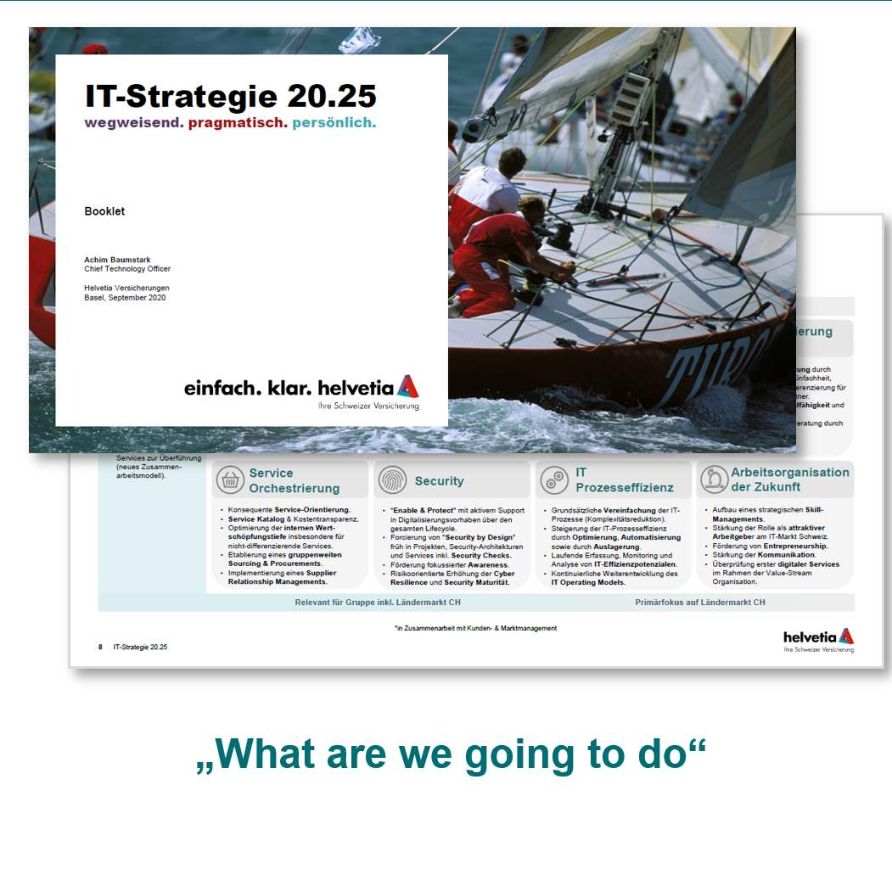  
          <strong><a href="https://wiki.helvetia.group/display/ITSD/IT+Strategie+20.25">IT Strategy</a></strong>
        </lia-keep>
      

    

  

  

    

      

          
        <strong>How we are going to do it?</strong>
      

      

        <lia-keep>
          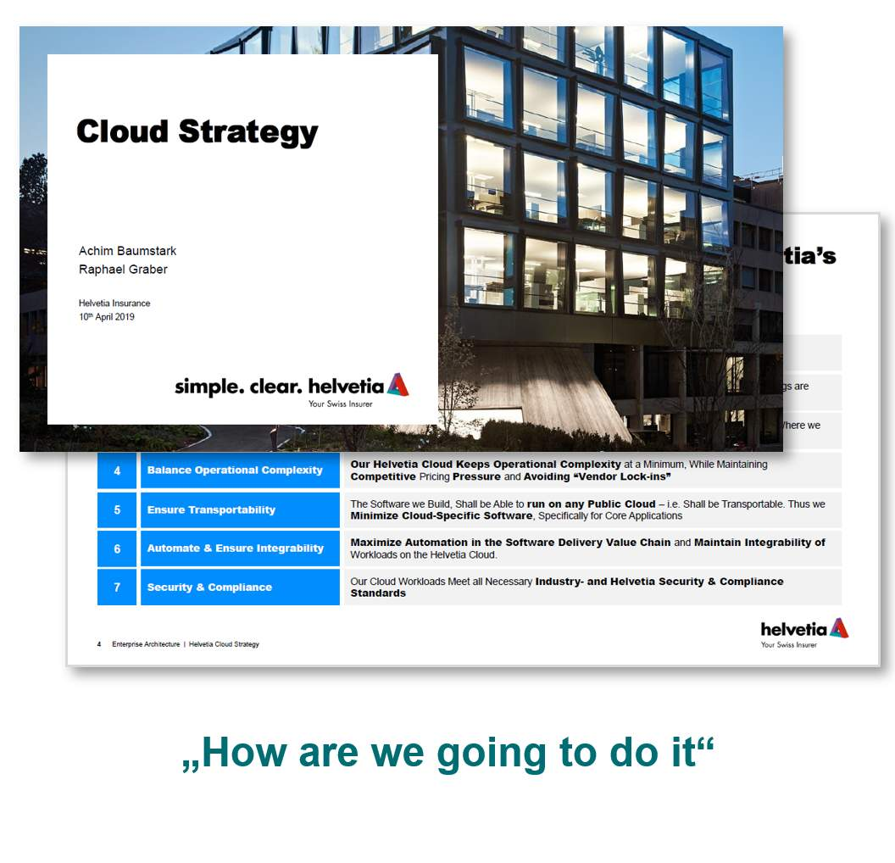  
          <strong><a href="https://wiki.helvetia.group/display/ITSD/IT+Strategie+20.25">Cloud Strategy</a></strong>
        </lia-keep>
      

    

  

  

    

      

          
        <strong>To which extent</strong>
      

      

        <lia-keep>
          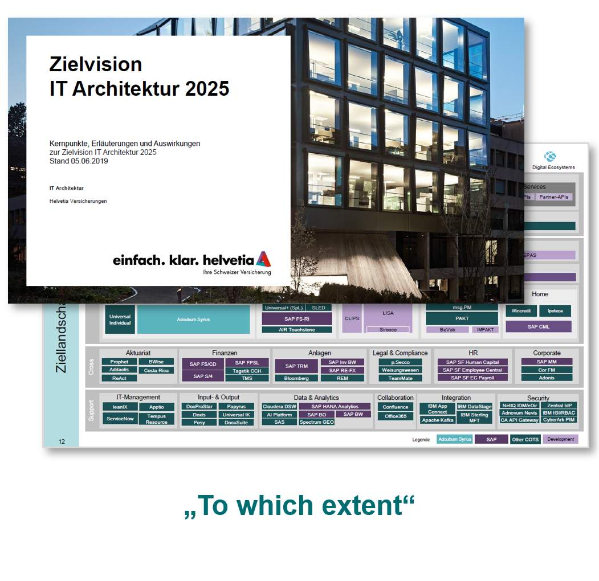  
          <strong><a href="https://wiki.helvetia.group/display/ITSD/IT+Strategie+20.25">Target Enterprise Architecture</a></strong>
        </lia-keep>
      

    

  

  

Enterprise Software Delivery

The pace of innovation was constantly high in the IT sector and each innovative iteration added a layer on top, making the cake bigger but also difficult to digest if seen as a whole. Cloud Computing, Containers, Container Orchestration, Microservices and Service Meshes not only enabled us to operate and deploy our software easier but also affected the way on how we can architect and model our software landscape under such circumstances.

No longer are we bound to layered architectural designs that became basically a synonym for enterprise software architecture. Now Event-driven, Microkernel, Microservices or Space-based architectures provide us with different ways on how to architect and build software systems and select the architecture the fits best.

Event-driven processing and streaming becomes the key concept in the enterprise architecture of Helvetia.

  **Good Read!** 
  [Software Architecture Patterns Report](https://learning.oreilly.com/library/view/software-architecture-patterns/9781491971437/) 
  Dive into common software architecture patterns. Where each pattern is explained on how it works, its benefits, and circumstances it is useful. An analysis and scorecard for each pattern based on several architecture and software development quality attributes helps to keep a high-level overview.

  

  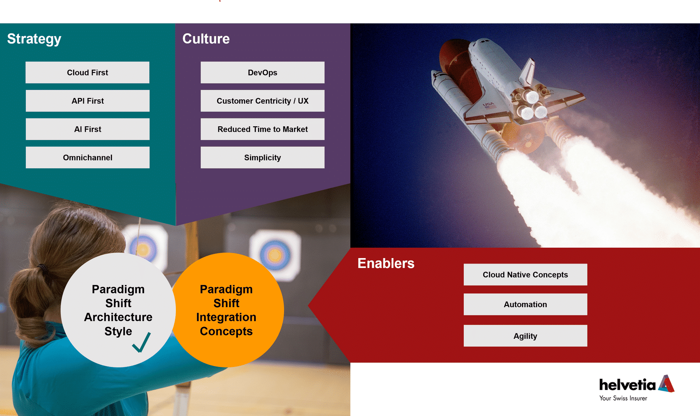

  <input type="radio" name="hotspot" id="toggle0" checked hidden>

  

    <input type="radio" name="hotspot" id="toggle1">
    <label for="toggle1" class="hotspot-btn">1</label>
    

      

        
Paradigm Shift

        

          <label for="toggle2" class="nav-btn next">></label>
          <label for="toggle0" class="close-btn">x</label>
        

      

      <audio controls style="width: 100%; max-width: 400px;">
        <source src="https://articulate-us.s3.amazonaws.com/rise/courses/SnwEb9zji8P0azXWalkZoW8sSN1n2VEq/I7fJAMAP-nN-YvB2-recording.mp3" type="audio/mpeg">
        Your browser does not support the audio element.
      </audio>
      

        So when we started thinking about HIP, all these drivers were already in place and we had already shown that we can achieve a paradigm shift with respect to Application Architecture and it was very successful. And we wanted to take those elements and also apply it to Integration to achieve a similar Paradigm Shift.
      

    

  

  

    <input type="radio" name="hotspot" id="toggle2">
    <label for="toggle2" class="hotspot-btn">2</label>
    

      

        
Industry Trends

        

          <label for="toggle1" class="nav-btn prev"><</label>
          <label for="toggle3" class="nav-btn next">></label>
          <label for="toggle0" class="close-btn">x</label>
        

      

      <audio controls style="width: 100%; max-width: 400px;">
        <source src="https://articulate-us.s3.amazonaws.com/rise/courses/SnwEb9zji8P0azXWalkZoW8sSN1n2VEq/35y_qluO6Cx4ChkU-recording.mp3" type="audio/mpeg">
        Your browser does not support the audio element.
      </audio>
      

        And then we looked at the industry. Mega Trends like Cloud Native with Docker and Container Management Platform Software. Automation with Infrastructure as Code, declarative Configuration, GitOps and so on. The keyword Agility shows that these enablers are not restricted to tools, but extend to processes, as well, e.g. Scrum.
        So these enablers would help us to achieve this Paradigm Shift with how we envisioned Modern Integration.
      

    

  

  

    <input type="radio" name="hotspot" id="toggle3">
    <label for="toggle3" class="hotspot-btn">3</label>
    

      

        
Helvetia Drivers

        

          <label for="toggle2" class="nav-btn prev"><</label>
          <label for="toggle0" class="close-btn">x</label>
        

      

      <audio controls style="width: 100%; max-width: 400px;">
        <source src="https://articulate-us.s3.amazonaws.com/rise/courses/SnwEb9zji8P0azXWalkZoW8sSN1n2VEq/Nst9z92eZOLvl7In-recording.mp3" type="audio/mpeg">
        Your browser does not support the audio element.
      </audio>
      

        This slide is from a Slide Deck called Target Vision Modern Integration that we compiled in early 2020 when we started thinking how we would design the new Helvetia Integration Platform. The strategic drivers were there. Cloud first: focus our efforts on the cloud, because that's where most of our users were going to be. API first: Focus on APIs, allowing software components to interact easily. AI first and Omnichannel, meaning that we wanted good quality data, in real-time; both for analytics and operational use.
        And then Culture. We were already switching to DevOps in the organization. We were putting a focus on the Customer and the user Experience. We wanted to be faster on the market with simpler solutions.
      

    

  

  

    

      API first
    

    

      <lia-keep> 
        Applications must expose their core functions and data as reusable, standardized APIs. Event-driven architectures are to be preferred.
      </lia-keep>
    

  

  

    

      Cloud first
    

    

      <lia-keep> 
        Consider the cloud before any other possible solution, either when optimizing IT or launching new projects.
      </lia-keep>
    

  

  

    

      Platforms
    

    

      <lia-keep> 
        Platforms to automate processes and standardize and reuse code.
      </lia-keep>
    

  

The Challenges Solved by HIP

With advanced integration capabilities, we can connect quickly and flexibly with partners and ecosystems and promote the decoupling of our application landscape.

  <ul>
    <li>Agile integration capabilities</li>
    <li>Decoupling front to back</li>
    <li>End-to-end process automation</li>
    <li>Self Service</li>
  </ul>

The Helvetia Integration Platform (HIP)

HIP provides a central integration layer between customer interaction and back office. It is the new integration backbone for synchronous and asynchronous communication between all Helvetia systems. HIP is the standard way of bringing an agile and fast integration method for internal and external systems. Building upon existing, established and open source technologies, HIP stands for standardization according to modern industry standards.

Helvetia Integration Platform (HIP) is the Strategic Platform for cross-domain Integration projects.

  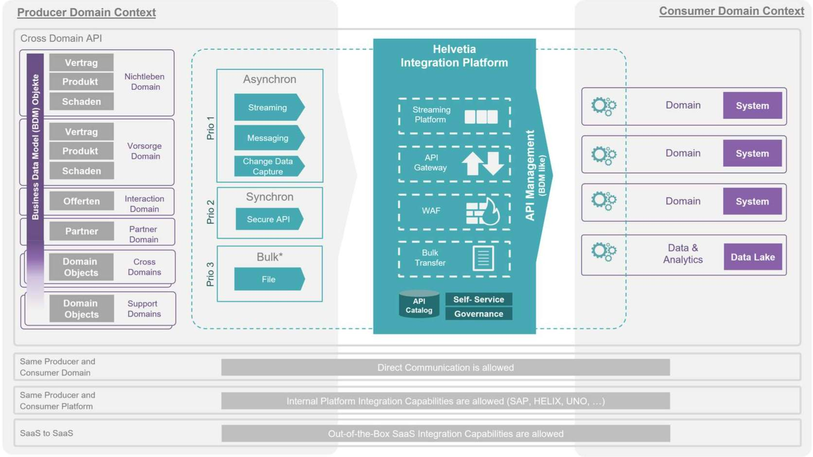

  <input type="radio" name="hotspot2" id="toggle0b" checked hidden>

  

    <input type="radio" name="hotspot2" id="toggle4">
    <label for="toggle4" class="hotspot-btn">1</label>
    

      

        
Domain-Driver Approach

        

          <label for="toggle5" class="nav-btn next">></label>
          <label for="toggle0b" class="close-btn">x</label>
        

      

      <audio controls style="width: 100%; max-width: 400px;">
        <source src="https://articulate-us.s3.amazonaws.com/rise/courses/SnwEb9zji8P0azXWalkZoW8sSN1n2VEq/I7fJAMAP-nN-YvB2-recording.mp3" type="audio/mpeg">
        Your browser does not support the audio element.
      </audio>
    

  

  

    <input type="radio" name="hotspot2" id="toggle5">
    <label for="toggle5" class="hotspot-btn">2</label>
    

      

        
Integration Patterns

        

          <label for="toggle4" class="nav-btn prev"><</label>
          <label for="toggle6" class="nav-btn next">></label>
          <label for="toggle0b" class="close-btn">x</label>
        

      

      <audio controls style="width: 100%; max-width: 400px;">
        <source src="https://articulate-us.s3.amazonaws.com/rise/courses/SnwEb9zji8P0azXWalkZoW8sSN1n2VEq/35y_qluO6Cx4ChkU-recording.mp3" type="audio/mpeg">
        Your browser does not support the audio element.
      </audio>
    

  

  

    <input type="radio" name="hotspot2" id="toggle6">
    <label for="toggle6" class="hotspot-btn">3</label>
    

      

        
HIP

        

          <label for="toggle5" class="nav-btn prev"><</label>
          <label for="toggle7" class="nav-btn next">></label>
          <label for="toggle0b" class="close-btn">x</label>
        

      

      <audio controls style="width: 100%; max-width: 400px;">
        <source src="https://articulate-us.s3.amazonaws.com/rise/courses/SnwEb9zji8P0azXWalkZoW8sSN1n2VEq/Nst9z92eZOLvl7In-recording.mp3" type="audio/mpeg">
        Your browser does not support the audio element.
      </audio>
    

  

  

    <input type="radio" name="hotspot2" id="toggle7">
    <label for="toggle7" class="hotspot-btn">4</label>
    

      

        
API Catalog & Self-Service

        

          <label for="toggle6" class="nav-btn prev"><</label>
          <label for="toggle0b" class="close-btn">x</label>
        

      

      <audio controls style="width: 100%; max-width: 400px;">
        <source src="https://articulate-us.s3.amazonaws.com/rise/courses/SnwEb9zji8P0azXWalkZoW8sSN1n2VEq/Nst9z92eZOLvl7In-recording.mp3" type="audio/mpeg">
        Your browser does not support the audio element.
      </audio>
    

  

Main Tasks of the Helvetia Integration Platform

The main task of the integration architecture is to support Helvetia in its transformation to a data-driven enterprise.

Domains have the freedom to design the processes, data products and interfaces they should exchange with other domains (technical as well as functional). This is accompanied by the transfer of responsibility to the respective process and data and application owners.

This is made possible by loose coupling and event-driven and asynchronous integration.

Helvetia Integration Platform (HIP) is the Strategic Platform for **cross-domain integration projects**.  

  <ul>
    <li>Use of standardized APIs implementing the **Business Data Models (BDM)**</li>
    <li>Use of overarching **Security Concepts**</li>
    <li>**Decentralized development, DevOps Operations, Agility**</li>
    <li>Enable **Self Service** and **Automation**</li>
    <li>Support of **Event-driven architecture** and **API-led connectivity**</li>
  </ul>

   

Integration process with HIP

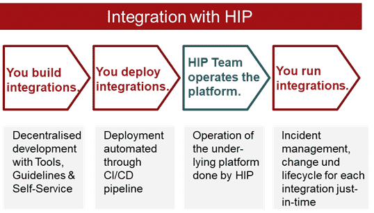

How does HIP work?

The Helvetia Integration Platform (HIP) enables teams to connect applications and data on premise, in the cloud or hybrid. Each connection is reusable and helps building an application network of pluggable assets, that enable teams to self serve and deliver projects faster!  

  <ul>
    <li>Synchronous</li>
    <li>Asynchronous</li>
    <li>Bulk</li>
  </ul>

  

  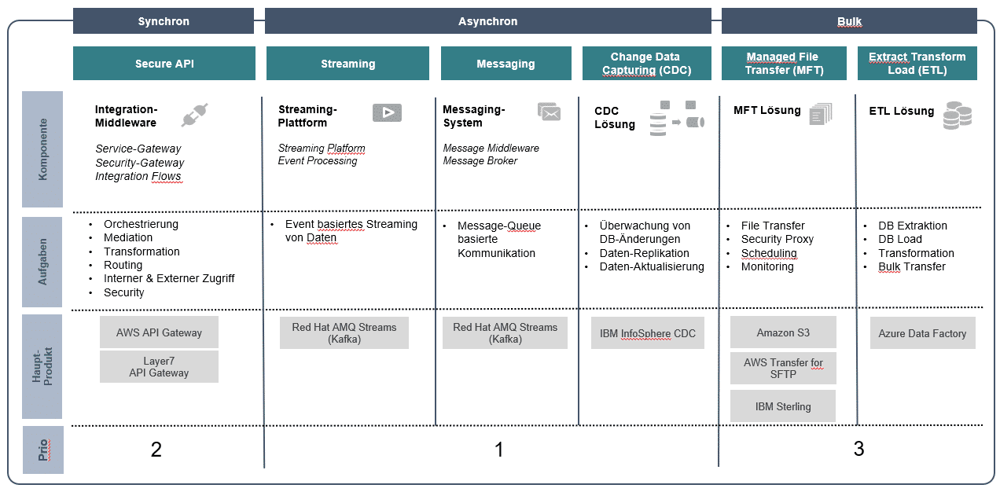

  <input type="radio" name="hotspotIP" id="toggle0c" checked hidden>

  

    <input type="radio" name="hotspotIP" id="toggle8">
    <label for="toggle8" class="hotspot-btn">1</label>
    

      

        
Integration Patterns

        

          <label for="toggle9" class="nav-btn next">></label>
          <label for="toggle0c" class="close-btn">x</label>
        

      

      <audio controls style="width: 100%; max-width: 400px;">
        <source src="https://articulate-us.s3.amazonaws.com/rise/courses/SnwEb9zji8P0azXWalkZoW8sSN1n2VEq/omiORb67D0cN-0ud-recording.mp3" type="audio/mpeg">
        Your browser does not support the audio element.
      </audio>
    

  

  

    <input type="radio" name="hotspotIP" id="toggle9">
    <label for="toggle9" class="hotspot-btn">2</label>
    

      

        
Change Data Capture

        

          <label for="toggle8" class="nav-btn prev"><</label>
          <label for="toggle10" class="nav-btn next">></label>
          <label for="toggle0c" class="close-btn">x</label>
        

      

      <audio controls style="width: 100%; max-width: 400px;">
        <source src="https://articulate-us.s3.amazonaws.com/rise/courses/SnwEb9zji8P0azXWalkZoW8sSN1n2VEq/oSvhDKisKNv7RQbm-recording.mp3" type="audio/mpeg">
        Your browser does not support the audio element.
      </audio>
    

  

  

    <input type="radio" name="hotspotIP" id="toggle10">
    <label for="toggle10" class="hotspot-btn">3</label>
    

      

        
Priorization

        

          <label for="toggle9" class="nav-btn prev"><</label>
          <label for="toggle8" class="nav-btn next">></label>
          <label for="toggle0c" class="close-btn">x</label>
        

      

      <audio controls style="width: 100%; max-width: 400px;">
        <source src="https://articulate-us.s3.amazonaws.com/rise/courses/SnwEb9zji8P0azXWalkZoW8sSN1n2VEq/Pre73Pk_2dCdHLhT-recording.mp3" type="audio/mpeg">
        Your browser does not support the audio element.
      </audio>
    

  

HIP offers Guidelines and Help to choose and apply the best-suited integration scenario to support the Target Image and Transformation.

Summary

Now that you understand the situations from the business and IT side better as well as follow why Helvetia has extensively looked at integration patterns and ultimately implemented HIP to meet these needs. You should now know the answers for:
  

<ol class="circle-list">
  <li>Understand the business impact and its consequences on software delivery </li> 
  <li>The problems HIP solves</li> 
  <li>The advantages of HIP</li> 
</ol>
  

In the next chapter we are going to look on how HIP works on a more technical level.
  

References
  

  <b>[Target Vision Integration.pdf](#)</b> 
  1.4MB

  

# How does the Helvetia Integration Platform work?

Why Helvetia Integration Platform?

In the previous chapter we learned the background on why HIP is considered to be a strategic decision to become more customer centric and decision driven. In this chapter we look into how HIP works, followed by how a chapter on how to work with HIP.

HIP is not a Tool

The Helvetia Integration Platform is not a single software system, or a tool bought off the shelf from a software vendor. It is rather a set of different technologies and tools customized to work together. Following the purpose of amplifying the mind set of loosely coupled and asynchronous software systems and how those systems should exchange data.

  

    
  

  

    Thanks to Kafka and the automated Self-Service, I was able to build a real-time interface to ZEPAS within hours. This would have taken many days with other technologies used at Helvetia.
  

  

    _Philipp Willener_
  

How does HIP work?

The Helvetia Integration Platform (HIP) enables teams to connect applications and data on premise, in the cloud or hybrid. Each connection is reusable and helps to build an application network of pluggable assets that enable teams to self serve and deliver projects faster!

  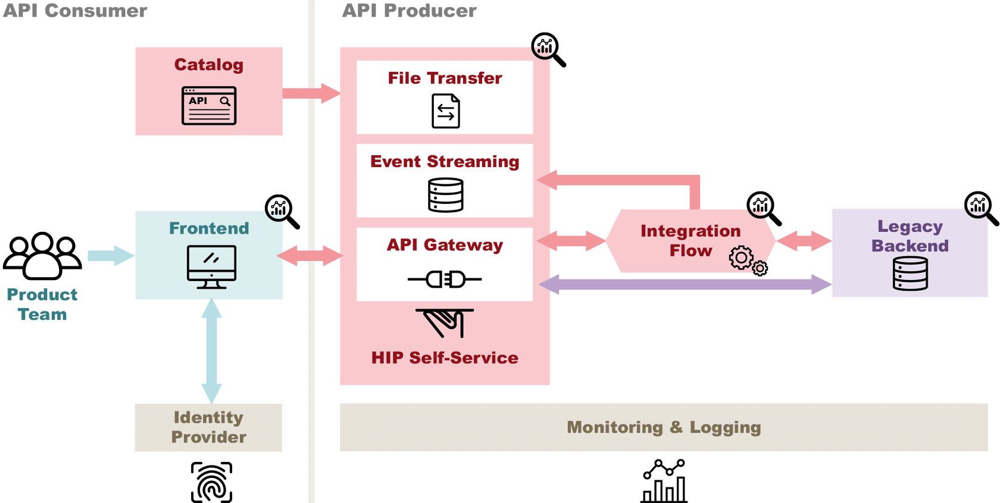

  

    <input type="checkbox" id="toggle11">
    <label for="toggle11" class="hotspot-btn">+</label>
    

      
API Catalog: reuse existing interfaces

        The API Catalog is a central element in our API landscape. The catalog is a directory that provides an overview of all available API types. Metadata and metrics provide information about each API available. Search and filter functions make sure that relevant APIs can be found easily and quickly. Every API and integration created with HIP increases the value of the application network and helps to make Helvetia a more agile and innovative organization!
    

  

  

    <input type="checkbox" id="toggle12">
    <label for="toggle12" class="hotspot-btn">+</label>
    

      
Security

        Layers of security are applied by default to protect your API. Control access and traffic to your API over OpenID Connect (OIDC) with ease.
    

  

  

    <input type="checkbox" id="toggle12">
    <label for="toggle12" class="hotspot-btn">+</label>
    

      
Automation: self-service capabilities of HIP

        HIP provides self-service capabilities that enable DevOps teams to publish or consume APIs according their needs. This reduces organizational dependencies and accelerates the provision of APIs through automation.  
        The self-service supports all three [integration patterns](https://wiki.helvetia.group/display/HIPUD/Choosing+Integration+Pattern) with different API types:

        - Event Streaming via Kafka  
        - HTTP APIs (REST/SOAP) via API Gateway  
        - Files via Bulk Transfer
    

  

  

    <input type="checkbox" id="toggle13">
    <label for="toggle13" class="hotspot-btn">+</label>
    

      
Integration Flows

        Integration Flows are used to integrate all kinds of systems and data formats with each other. The above overview provides a high-level view of how different systems can be integrated.

        The following characteristics apply to Integration Flows:

        - Integration Flows are microservices running specific integration code  
        - Integration flows are developed and operated by DevOps teams (decentral integration)  
        - HIP provides templates, guidelines and a platform for building Integration Flows
    

  

  

    <input type="checkbox" id="toggle14">
    <label for="toggle14" class="hotspot-btn">+</label>
    

      
Monitoring & Logging

        End-to-end monitoring and logging dashboards are provided and can be customized to your personal needs.
    

  

Integration Components

When we show up to the present moment with all of our senses, we invite the world to fill us with joy. The pains of the past are behind us. The future has yet to unfold. But the now is full of beauty simply waiting for our attention.

**API-Portal**

As the central element in the API landscape, the API Portal is a directory with all registered APIs, specifications, metadata, and metrics that provide information for each API much like a product catalog. Teams within Helvetia use the API catalogs to organize public and internal APIs.

The API-Portal allows developers to discover and use internal APIs, rather than having to hunt down many places or contact multiple people to find APIs. In a company, the size of Helvetia, developers might not even know what internal APIs already exist, but an API catalog can help solve this problem.

Every API and integration added to the catalog increases the value of the application and the HIP network.

  [**Expose and access an Outbound HTTP API**](https://wiki.helvetia.group/x/-gFIXQ)

 
Outbound interfaces are connections from Helvetia systems via the Internet to external partners or public interfaces (APIs), such as Google. HIP offers a self-service, which can be used for the configuration of HTTP REST interfaces. Thus, HIP supports all communication directions for the REST technology standard.

  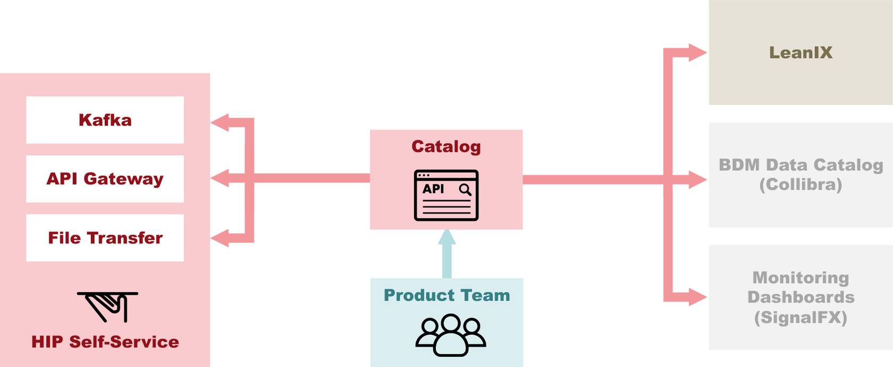

  <input type="radio" name="hotspotAPI" id="toggle0d" checked hidden>

  

    <input type="radio" name="hotspotAPI" id="toggle15">
    <label for="toggle15" class="hotspot-btn">+</label>
    

      

        
API Catalog

        

          <label for="toggle16" class="nav-btn next">></label>
          <label for="toggle0d" class="close-btn">x</label>
        

      

      <audio controls style="width: 100%; max-width: 400px;">
        <source src="https://articulate-us.s3.amazonaws.com/rise/courses/SnwEb9zji8P0azXWalkZoW8sSN1n2VEq/MWs0-twX7kk7KdSc-recording.mp3" type="audio/mpeg">
        Your browser does not support the audio element.
      </audio>
    

  

  

    <input type="radio" name="hotspotAPI" id="toggle16">
    <label for="toggle16" class="hotspot-btn">+</label>
    

      

        
HIP Self-Service

        

          <label for="toggle15" class="nav-btn prev"><</label>
          <label for="toggle17" class="nav-btn next">></label>
          <label for="toggle0d" class="close-btn">x</label>
        

      

      <audio controls style="width: 100%; max-width: 400px;">
        <source src="https://articulate-us.s3.amazonaws.com/rise/courses/SnwEb9zji8P0azXWalkZoW8sSN1n2VEq/6FLj93K1QzE6Vn6m-recording.mp3" type="audio/mpeg">
        Your browser does not support the audio element.
      </audio>
    

  

  

    <input type="radio" name="hotspotAPI" id="toggle17">
    <label for="toggle17" class="hotspot-btn">+</label>
    

      

        
Third Party Integrations

        

          <label for="toggle16" class="nav-btn prev"><</label>
          <label for="toggle15" class="nav-btn next">></label>
          <label for="toggle0d" class="close-btn">x</label>
        

      

      <audio controls style="width: 100%; max-width: 400px;">
        <source src="https://articulate-us.s3.amazonaws.com/rise/courses/SnwEb9zji8P0azXWalkZoW8sSN1n2VEq/85GTHQHYmm2QxinM-recording.mp3" type="audio/mpeg">
        Your browser does not support the audio element.
      </audio>
    

  

---

**Kafka**

The component within HIP that is used the most and receives the most attention. Apache Kafka® is a distributed streaming platform that:

  <ul>
    <li>Publishes and subscribes to streams of records, similar to a message queue or enterprise messaging system.</li>
    <li>Stores streams of records in a fault-tolerant durable way.</li>
    <li>Processes streams of records as they occur.</li>
  </ul>

**Typical Use Cases for Kafka**

Kafka is used for these broad classes of applications:

  <ul>
    <li>Messaging, as a replacement for a more traditional message broker.</li> 
    <li>Stream Processing</li> 
    <li>Real-Time Data Provisioning</li> 
    <li>Real-Time Data Analytics</li> 
    <li>IoT</li> 
    <li>Decoupling of Systems</li>
  </ul>

[Here](https://kafka.apache.org/uses) is a description of a few of other popular use cases for Apache Kafka®

The following list gives an orientation for which purposes Kafka should be used best. Even if the list is incomplete and oversimplified, it is a good north star.

Do use Kafka, if you...
 

  <ul>
    <li>... need **scalability**</li>
    <li>... need **throughput**</li>
    <li>... **process a lot of data**</li>
    <li>... need **resilience**</li>
    <li>... do **stream processing**</li>
    <li>... do **reactive programming**</li>
    <li>... are designing an **event-driven application**</li>
    <li>... consume **events in order**</li>
    <li>... want to **push data** (as opposed to pull)</li>
  </ul>

  

  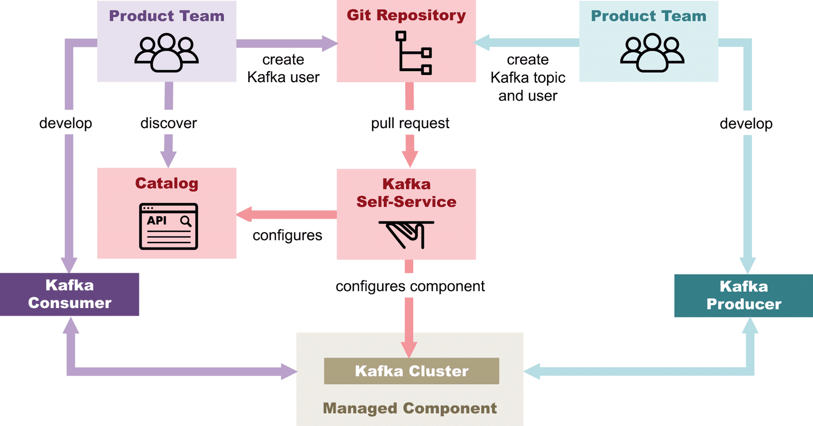

  <input type="radio" name="hotspotKafka" id="toggle0e" checked hidden>

  

    <input type="radio" name="hotspotKafka" id="toggle18">
    <label for="toggle18" class="hotspot-btn">1</label>
    

      

        
Kafka Self-Service

        

          <label for="toggle19" class="nav-btn next">></label>
          <label for="toggle0e" class="close-btn">x</label>
        

      

      <audio controls style="width: 100%; max-width: 400px;">
        <source src="https://articulate-us.s3.amazonaws.com/rise/courses/SnwEb9zji8P0azXWalkZoW8sSN1n2VEq/UX-u4Y5IbPnhyQfu-recording.mp3" type="audio/mpeg">
        Your browser does not support the audio element.
      </audio>
    

  

  

    <input type="radio" name="hotspotKafka" id="toggle19">
    <label for="toggle19" class="hotspot-btn">2</label>
    

      

        
Kafka Consumer

        

          <label for="toggle18" class="nav-btn prev"><</label>
          <label for="toggle0e" class="close-btn">x</label>
        

      

      <audio controls style="width: 100%; max-width: 400px;">
        <source src="https://articulate-us.s3.amazonaws.com/rise/courses/SnwEb9zji8P0azXWalkZoW8sSN1n2VEq/JnUfUDc7PB6EagHb-recording.mp3" type="audio/mpeg">
        Your browser does not support the audio element.
      </audio>
    

  

Bulk Transfer

Historically, most data processing technologies, such as data warehousing, were designed for batch processing. It’s true that real-time and streaming data integration technologies are currently getting more attention. But just as radio owns a place in the age of television, batch processing won’t go away any time soon.

Batch jobs process large volumes of records all at once. Newly arriving data elements are collected into a group, which is then processed at a future time.

Benefits: High Performance, Lower Costs

Optimized to perform high-volume, repetitive tasks, batch processing provides a fast way to process large amounts of data. For example, inserting 20,000 rows into your database is much quicker in a batch process than inserting each row as a separate transaction. Operational costs are also reduced because automated processing eliminates the need for specialized data entry clerks.

Use Cases

Batch processing is typically used to perform high-volume, repetitive tasks that don't require the most up-to-date data. At Helvetia we may employ a batch process to update a data warehouse at the end of the day with production data. We may also turn to batch processes to generate reports, print documents, and perform other non-interactive tasks that must complete reliably within certain business deadlines.

Architecture

A batch processing architecture has the following components:

  <ul>
    <li>**Data storage**. A repository for high volumes of data in various formats. This can be a data warehouse or a data lake.</li> 
    <li>**Batch processing jobs**. These jobs read source data, process it, and write the output to new storage locations.</li> 
    <li>**Analytical data store**. Many batch jobs are designed to prepare data for analysis and then serve the processed data in a structured format that can be queried using analytical tools.</li> 
    <li>**Analysis and reporting tools.** The goal of many batch processing jobs is to provide insights into the data through analysis and reporting.</li> 
    <li>**Orchestration.** Typically, some orchestration is required to migrate or copy the data into your data storage, batch processing, analytical data store, and reporting layers.</li> 
  </ul>

  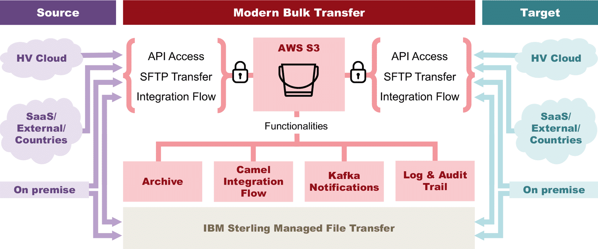

  <input type="radio" name="hotspotFile" id="toggle0f" checked hidden>

  

    <input type="radio" name="hotspotFile" id="toggle20">
    <label for="toggle20" class="hotspot-btn">+</label>
    

      

        
S3 Self-Service

        

          <label for="toggle0f" class="close-btn">x</label>
        

      

      <audio controls style="width: 100%; max-width: 400px;">
        <source src="https://articulate-us.s3.amazonaws.com/rise/courses/SnwEb9zji8P0azXWalkZoW8sSN1n2VEq/QCS5wZMli75170Hi-recording.mp3" type="audio/mpeg">
        Your browser does not support the audio element.
      </audio>
    

  

Integration Flows

Integration Flows are patterns and a set of tools that will help you connect one system to another as well as transforming from one data format to another.

There are a few major drivers when you would want to use an Integration Framework:

<ol class="circle-list">
  <li>**Integrating applications together**:  
   For situations where you need to move data between different protocols and applications (like files, emails, APIs or web apps).  
   You can use Apache Camel when you want to move data between any one of the apps and protocols supported by its 200+ components. Components in Camel generally all work in a similar way. So, once you understand how to use one component, you will find it easier to use others. Camel includes components for many different apps, from Facebook and Twitter, to Salesforce and Workday. You can also write your own custom component.</li> 
  <li>**Pattern-based development**:  
   Many frequent requirements for integration – like support for transactions, or transformation – would usually be complicated to plan and write in code. But Camel provides many of these, and can often be enabled with just the flick of a switch (OK, by just changing a variable!).  
   Camel provides patterns and functionality for things like: 
   - Routing data based on its content, using Camel’s content-based routing 
   - Handling errors, transactions and rollbacks 
   - Transforming data 
   - Caching frequently-accessed data 
   - Encryption and authentication</li> 
  <li>**One high-level style for many integrations**:  
   Once you’ve learned the basic patterns, and how to work with Camel components, you’ll find that it becomes easy to churn out many integrations in Camel.  
   This is an advantage of Camel: the ability to create many integrations fairly quickly. Camel is ideal if you are developing a set of integrations, and you would like them all to be developed in a similar way.</li> 
  <li>**Working with data, and especially Java objects**:  
   As it’s a Java framework, it’s especially good at working with Java objects. So if you’re working with a file format that can be deserialized into a Java object, then it will be handled easily by Camel.</li>
</ol>
  

The following characteristics apply to Integration Flows:

  <ul>
    <li>Containerized microservices running dedicated integration code</li> 
    <li>Integration flows are developed and operated by DevOps teams</li> 
    <li>Each integration flow is running in a decentralized way in the projects of the corresponding teams</li> 
  </ul>

  **Integration Flows are replacing the IBM Integration Bus (IIB).**

How to build Integration Flows?

Integration flows are typically developed with Apache Camel on Quarkus. These integrations are built on top of the [HMP (Helvetia Microservice Project)](https://wiki.helvetia.group/display/HVCPFDV/HMP+Development) stack.

A [dedicated development page](https://wiki.helvetia.group/display/HIPUD/Development) contains further information on building Integration Flows.

How to Start?

The [Getting Started page](https://wiki.helvetia.group/display/HIPUD/Getting+Started) will guide you through a first example and shows you how to use the specialized HMP template for creating integration services.

  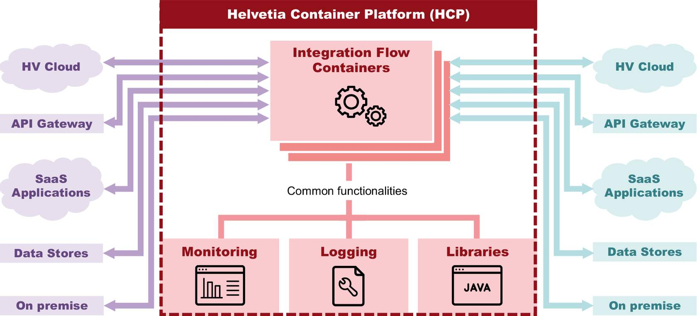

  <input type="radio" name="hotspotFlow" id="toggle0g" checked hidden>

  

    <input type="radio" name="hotspotFlow" id="toggle21">
    <label for="toggle21" class="hotspot-btn">+</label>
    

      

        
Integration Flow

        

          <label for="toggle12" class="nav-btn next">></label>
          <label for="toggle0g" class="close-btn">x</label>
        

      

      <audio controls style="width: 100%; max-width: 400px;">
        <source src="https://articulate-us.s3.amazonaws.com/rise/courses/SnwEb9zji8P0azXWalkZoW8sSN1n2VEq/4V3LivgcsUHzfdUu-recording.mp3" type="audio/mpeg">
        Your browser does not support the audio element.
      </audio>
    

  

  

    <input type="radio" name="hotspotFlow" id="toggle22">
    <label for="toggle22" class="hotspot-btn">+</label>
    

      

        
Sources and Targets

        

          <label for="toggle21" class="nav-btn next"><</label>
          <label for="toggle0g" class="close-btn">x</label>
        

      

      <audio controls style="width: 100%; max-width: 400px;">
        <source src="https://articulate-us.s3.amazonaws.com/rise/courses/SnwEb9zji8P0azXWalkZoW8sSN1n2VEq/xdkUnTC4leVdTKFe-recording.mp3" type="audio/mpeg">
        Your browser does not support the audio element.
      </audio>
    

  

API Gateway

Applications and services which talk to each other over HTTP APIs are everywhere:  
- in microservice environments  
- between front and host systems  
- from a SaaS to an internal application (or vice versa)  
- and many more.

Traditionally, these integrations are implemented “point to point” without an API gateway in between.

An **API gateway** acts as a proxy for your application:  
- exposing the public-facing API endpoints  
- routing incoming client requests to the relevant services  
- transforming them as required  
- aggregating the response data before sending the response to the client

An API gateway provides a **clean interface for clients** to interact with, making your system easier to use and more attractive for consumers.
  

  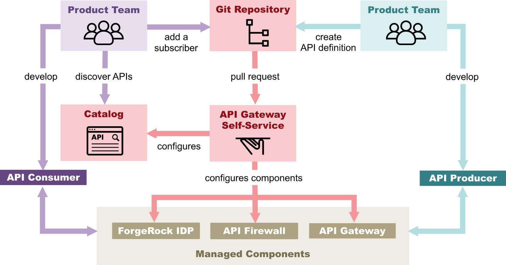

  <input type="radio" name="hotspotApi" id="toggle0h" checked hidden>

  

    <input type="radio" name="hotspotApi" id="toggle23">
    <label for="toggle23" class="hotspot-btn">1</label>
    

      

        
API Gateway Self-Service

        

          <label for="toggle24" class="nav-btn"><</label>
          <label for="toggle0h" class="close-btn">x</label>
        

      

      <audio controls style="width:100%; max-width:400px;">
        <source src="https://articulate-us.s3.amazonaws.com/rise/courses/SnwEb9zji8P0azXWalkZoW8sSN1n2VEq/7mxtadzNI4LQidFK-recording.mp3" type="audio/mpeg">
        Your browser does not support the audio element.
      </audio>
    

  

  

    <input type="radio" name="hotspotApi" id="toggle24">
    <label for="toggle24" class="hotspot-btn">2</label>
    

      

        
API Subscribers

        

          <label for="toggle23" class="nav-btn">></label>
          <label for="toggle0h" class="close-btn">x</label>
        

      

      <audio controls style="width:100%; max-width:400px;">
        <source src="https://articulate-us.s3.amazonaws.com/rise/courses/SnwEb9zji8P0azXWalkZoW8sSN1n2VEq/utTng13vfYHKtfi_-recording.mp3" type="audio/mpeg">
        Your browser does not support the audio element.
      </audio>
    

  

# Using the Helvetia Integration Platform

Heading

Before we dive into the offered HIP integration technologies,  
we are first going to understand the HIP concepts and the API Portal.

**Overall HIP concepts:**  
Understand the HIP principles and solution that are based on  
the architecture concepts covered in the previous chapter.

Choosing Integration Pattern

The HIP Integration Strategy defines **three integration patterns** with the following **priority of choice**:

| Priority | Pattern                  | Technology                       |
|---------:|--------------------------|----------------------------------|
| 1        | Asynchronous Integration | Kafka Event Streaming            |
| 2        | Synchronous Integration  | HTTP APIs over HIP API Gateway  |
| 3        | Bulk                     | FileTransfer                     |

Examples of the concrete integration patterns are shown in the following sections.

Asynchronous Integration (Kafka Event Streaming)

When we show up to the present moment with all of our senses,  
we invite the world to fill us with joy.  
The pains of the past are behind us. The future has yet to unfold.  
But the **now** is full of beauty simply waiting for our attention.

Before we start thinking about asynchronous, event-driven integration,  
let’s think about what an **“event”** is in our context.

An event is any type of **action, incident, or change** that’s identified or recorded by software or applications.  
For example:  
- a payment  
- a website click  
- or a temperature reading  

Each event includes a description of **what happened**.

  <label class="accordion-label" for="acc1">**Integration using Kafka Connect API**</label>
  <input type="checkbox" id="acc1">
  

    Kafka Connect is a tool for scalably and reliably streaming data between Apache Kafka and other systems. Kafka Connect runs so called connectors that integrate a specific source with Kafka (or vice versa). There is a wide range of connectors available (e.g. HDFS, S3, JDBC, etc.)
    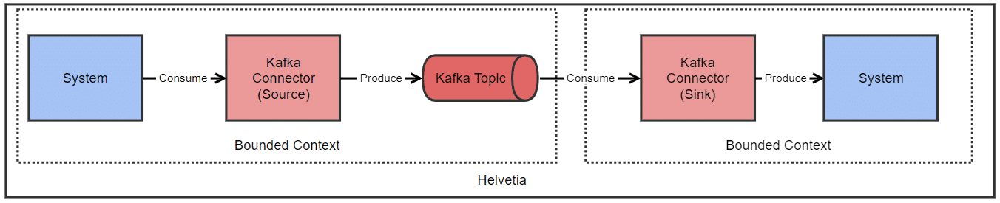
  

  <label class="accordion-label" for="acc2">**Integration using Kafka Producer & Consumer API**</label>
  <input type="checkbox" id="acc2">
  

    Kafka offers a Producer API and a Customer API to write and consume events respectively. A Kafka Topic typically resides in the Bounded Context of the producer.
    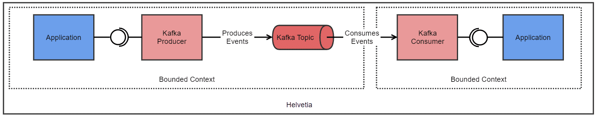
  

  <label class="accordion-label" for="acc3">**Integration using Kafka Streams API**</label>
  <input type="checkbox" id="acc3">
  

    Kafka Streams is a client library for building applications and microservices using Kafka topics as input and output.  
    It is well-suited to filter, combine Kafka Events and perform complex, stateful transformations.
    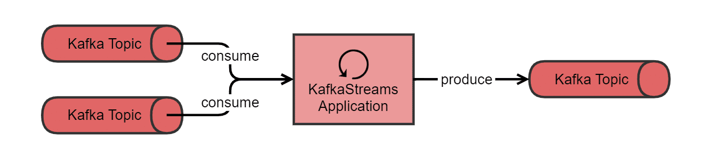
  

  <label class="accordion-label" for="acc4">**Integration with Kafka using CDC**</label>
  <input type="checkbox" id="acc4">
  

    Change Data Capture (CDC) is a pattern for continuous data integration. CDC identifies and captures changes mode to a database. Those changes can be transmitted to another data store such as Kafka.
    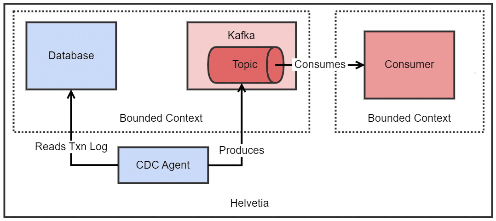
  

  <label class="accordion-label" for="acc5">**Integration with Kafka using CDC and Target DB**</label>
  <input type="checkbox" id="acc5">
  

    Using CDC + Kafka, real-time data integration can be achieved.
    But what if the consumer can’t talk to Kafka directly (e.g. a custom Excel application)?  
    In such cases, use a Kafka Connect Sink to push data to a target database.
    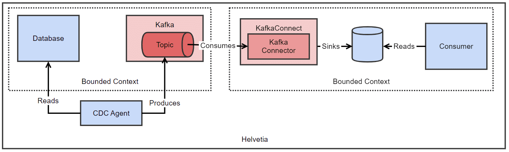
  

  

  More Information on HTTP APIs 
  

    <ul>
      <li>[HTTP API Concepts](https://wiki.helvetia.group/display/HIPUD/HTTP+API+Concepts)</li>
      <li>[HIP Integration Concept – Communication Patterns](https://wiki.helvetia.group/display/HIPUD/HIP+Integration+Concepts#HIPIntegrationConcepts-CommunicationPatterns)</li>
    </ul>
  

Synchronous Integration (HTTP APIs)

  <label class="accordion-label" for="acc6">**Internal APIs consumption / exposure**</label>
  <input type="checkbox" id="acc6">
  

    The HIP API Gateway is used to decouple API clients (HTTP client)from the API provider (HTTP upstream service).  
    The exposed API is always in the Bounded Context of the providing system.
    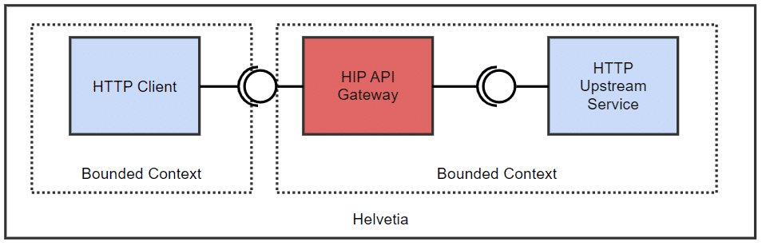
  

  <label class="accordion-label" for="acc7">**Exposing external APIs**</label>
  <input type="checkbox" id="acc7">
  

    The HIP API Gateway can expose APIs for Helvetia-external clients.  
    Again, the API resides in the Bounded Context of the provider system.
    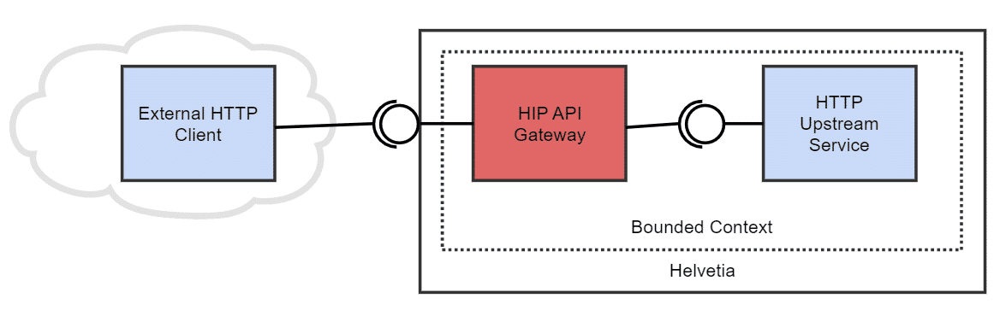
  

  <label class="accordion-label" for="acc8">**Consuming external APIs**</label>
  <input type="checkbox" id="acc8">
  

    Note about outgoing traffic: Proxy vs. API Gateway.
    It is currently under discussion whether outgoing traffic  should go through the API Gateway or via a proxy.
    When Helvetia applications access external APIs, the HIP API Gateway can be used.
    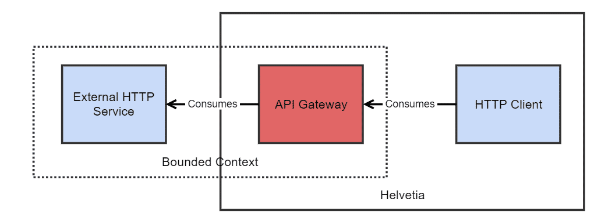
  

  

Bulk Transfer

  <label class="accordion-label" for="acc9">**Bulk File Simple / Notification**</label>
  <input type="checkbox" id="acc9">
  

    Bulk file transfers can be made via AWS S3 buckets, which allow for uploading/downloading large files.  
    The S3 topic is typically in the Bounded Context of the producer.  
    Optionally, a Kafka topic can be used to receive notification events from S3.
    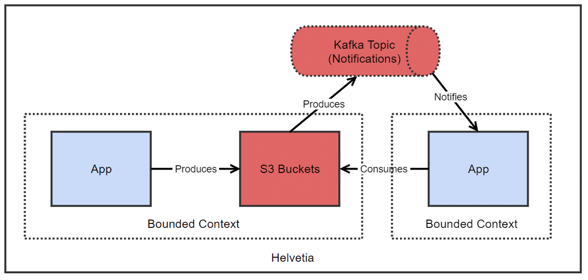
  

  

Integration Flows

[Integration Flows →](https://wiki.helvetia.group/display/HIPUD/Integration+Flows)

Integration flows are **not integration patterns**,  
but they can be used to build dedicated integrations.

They act as **glue** between systems or applications,  
depending on specific integration needs.

Use them when a **specific case** requires customized orchestration.

For example:
- Custom data enrichment between two internal services  
- Workflow-driven coordination between external and internal APIs

  <label class="accordion-label" for="acc10">**Integration Flow – Case 1**</label>
  <input type="checkbox" id="acc10">
  

    An application consumes an API from another application via API Gateway.The consuming application integrates the processing in its own application.The same applies to the backend application that provides the API.  
    In this ideal case, no additional integration flow is required,  as the integration is handled within the application itself.
    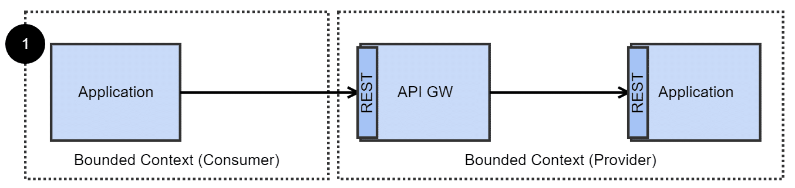
  

  <label class="accordion-label" for="acc11">**Integration Flow – Case 2**</label>
  <input type="checkbox" id="acc11">
  

    When the API consumer or provider has specific integration needs (e.g. transforming a REST API to an internal SOAP interface), and cannot adapt to a given interface (due to technical limits or cost), a dedicated integration flow helps to solve the issue.
    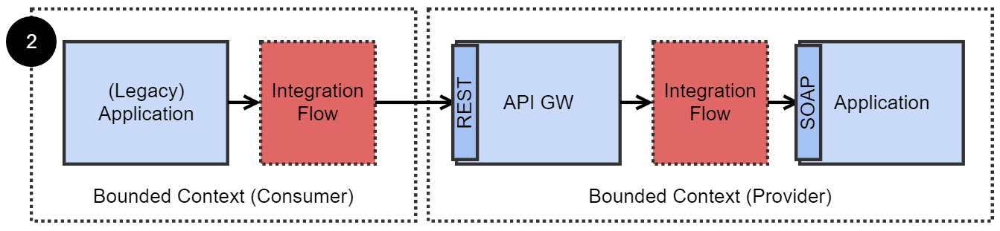
  

  

  **Integration Flows and other Integration Patterns**:
    The examples shown involve two Bounded Contexts communicating via HTTP API.  
    Integration flows can also be applied to other patterns (e.g., Kafka or Bulk Transfer).

HIP Integration Concepts

When we show up to the present moment with all of our senses,  
we invite the world to fill us with joy.  
The pains of the past are behind us. The future has yet to unfold.  
But the **now** is full of beauty simply waiting for our attention.

Introduction

This section contains a set of loosely connected concepts, principles, and patterns that are relevant in the context of the Helvetia Integration Platform (HIP). Terms are briefly described, often accompanied by links to further documentation and includes practical guidance (must/mustn't and do/don't) These concepts are referenced throughout the HIP documentation.

Integration Patterns

The HIP Integration Strategy defines three integration patterns:  
(see also: Choosing Integration Pattern)

1. Asynchronous Integration
2. Synchronous Integration
3. Bulk

  
DO: When given a choice, prefer:

  

    <table>
      <thead>
        <tr>
          <th>Priority</th>
          <th>Integration Pattern</th>
          <th>Technology</th>
        </tr>
      </thead>
      <tbody>
        <tr>
          <td>1</td>
          <td>Asynchronous Integration</td>
          <td>Kafka Event Streaming</td>
        </tr>
        <tr>
          <td>2</td>
          <td>Synchronous Integration</td>
          <td>HTTP APIs over HIP API Gateway</td>
        </tr>
        <tr>
          <td>3</td>
          <td>Bulk</td>
          <td>FileTransfer</td>
        </tr>
      </tbody>
    </table>
  

  
DO: Justify your choice in your documentation.

  MORE INFORMATION  
  [HIP Integration Strategy – Slide Deck (PPT)](https://wiki.helvetia.group/display/HIP/HIP+Integration+Architecture+Strategy)

Communication Patterns

Single-Purpose vs Multi-Purpose APIs

Modern Reference Architectures (e.g., [omesa.io](https://www.oreilly.com/library/view/implementing-oracle-api/9781788478656/30760282-df4e-4f48-bf97-d207fe8da30d.xhtml))  
differentiate APIs according to their usage: 

  <ul>
    <li>Single-Purpose APIs: Used within one Bounded Context or Application. Since producer and consumer are tightly coupled,  
    versioning and lifecycle management are less critical.</li>
    <li>Multi-Purpose APIs: Used across Bounded Contexts, throughout the organization, or even externally. Requires robust lifecycle management.</li>
  </ul>

  

  **MORE INFORMATION**  
  

    <ul>
      <li>[omesa.io](https://www.oreilly.com/library/view/implementing-oracle-api/9781788478656/30760282-df4e-4f48-bf97-d207fe8da30d.xhtml)</li>
      <li>[ADL-549: HIP API Gateway – Single vs Multi-Purpose APIs](https://wiki.helvetia.group/pages/viewpage.action?pageId=394945582#ADL549HIPAPIManagement/APIGateway-Single-Context&Multi-ContextAPIs)</li>
    </ul>
  

    
DO: Be explicit: Clearly define which of your APIs are Single-Purpose vs Multi-Purpose
 
    
DO: Use API Gateway The HIP API Gateway is intended for Multi-Purpose APIs

Intra-Helvetia Communication

Helvetia as an organization — and individual teams —  
must manage communication across Bounded Contexts.
Use HIP (Kafka, API Gateway, or Bulk) to decouple these communications,  
while benefiting from appropriate management features.

  
DO: When communicating across Bounded Contexts or using Multi-Purpose APIs, always decouple via HIP.

Communication to/from the Internet

Integrate Communication to/ from the internet (outside Helvetia) by using Synchronous Integration (HIP API Gateway & Broadcom API Gateway). Kafka is not exposed in the internet.

    
DO: Integrate inbound communication from the internet over HIP API Gateway.
 
    
DO: Integrate outbound communication to the internet over the Broadcom API Gateway. This solution is correctly under review.
 
    
MUST NOT: It’s not possible to integrate communication to/from the internet directly with Kafka.

Cross-Stage Communication

Cross-stage access is not allowed (e.g. DEVL client accessing INTG API). The credentials are stage-specific and cannot be used to grant cross-stage access. Certain Administration Tools (e.g. Git) are allowed to access and be accessed across stages.

    
DON'T: Don’t do integration using cross-stage communication.

HIP API Definition

An Application Programming Interface (API) is an explicitly defined contract that offers the possibility to interact with applications. Generally, such contract definitions contain interaction possibilities and a domain model defining supported data formats and behaviors. 

In the context of HIP, when talking about APIs, we consider the following elements:

  <ul>
    <li>HTTP APIs (REST & SOAP)</li>
    <li>Kafka Topics + Schemas</li>
    <li> (Managed File Transfer)</li>
  </ul>

 
* Not yet in scope.

Domain Driven Design (DDD)

Domain Driven Design (DDD) means aligning your software’s structure and terminology with the business domain. 

    
DO: Adhere to the DDD concepts.
 
    

      <ul>
        <li>Focus on the core **domain**.</li> 
        <li>Explore models in a creative collaboration of domain practitioners and software practitioners.</li> 
        <li>Speak a ubiquitous language within an explicitly bounded context</li> 
      </ul>
    
 

Bounded Context

Bounded Context is a design pattern in Domain Driven Design to deal with the complexity of large models by dividing them into different bounded contexts.

    
DO:Explicitly define the context within which a model applies.
 
    
DO:Explicitly set boundaries in terms of team organization, usage within specific parts of the application, and physical manifestations such as code bases and database schemas.

  MORE INFORMATION 

  

    <ul>
      <li>**Reference Guide:** [Domain-Driven Design Reference: Definitions and Pattern Summaries (PDF)](https://www.domainlanguage.com/wp-content/uploads/2016/05/DDD_Reference_2015-03.pdf) by Eric Evans, Domain Language Inc.</li> 
      <li>**Websites:** Martin Fowler on [Bounded Context](https://martinfowler.com/bliki/BoundedContext.html)</li>
    </ul>
  

Microservice Architecture & Helvetia Container Platform

Build your integrations using [Helvetia Container Platform (HCP) and a microservice architecture](https://wiki.helvetia.group/display/HVCPF/Microservice+Architecture+on+HCP). This allows you design your components as resilient microservices and scale them as needed. 

If you run your integration component on HCP, you will have more support, less issues, more time to spend on your actual problems and increased productivity. 

Should you do Microservice Architecture? [Trade-off Comparison](https://martinfowler.com/articles/microservice-trade-offs.html) by Martin Fowler. 

    
DO:Consider a Microservice Architecture for your HIP Component.
 
    
DO:Consider running your HIP Integration Component on HCP.

HCP Quarkus Technology Stack

Ideally, Integration Components are developed as microservices on HCP. While you can use any of the technology stacks mentioned here, there is a clear recommendation to use Quarkus. Quarkus is the supersonic, subatomic Java technology stack. A Kubernetes Native Java stack tailored for GraalVM & OpenJDK HotSpot, crafted from the best of breed Java libraries and standards: [https://quarkus.io/](https://quarkus.io/) 

You can find more about the development on HCP in the [HCP guides](https://wiki.helvetia.group/x/6n_dEQ). Additionally, HIP provides a specialized toolset (which is build on the HCP stack) for building integration microservices, called Integration Flows. Checkout the [Integration Flows](https://wiki.helvetia.group/display/HIPUD/Integration+Flows) section for further information. 

    
DO:Use the "Quarkus on HCP" technology stack for your Integration Component.

HCP Operations Model

While, as a client, you don't have to maintain the Integration infrastructure, you will have to maintain your own Integration Components. If your component is deployed on HCP, you have to operate it in a DevOps Mode. For more details, see: 

  <ul>
    <li>[HCP Operations Concept](https://wiki.helvetia.group/display/HVCPF/Operations+Concept)</li>
    <li>[HCP DevOps Philosophy](https://wiki.helvetia.group/display/HVCPFDV/General)</li>
  </ul>

 

You are responsible for running your Integration Components.

    
DO:Think about operations early. It is your responsibility to ensure the operation of your Integration Component.
 
    
DO:Run your Integration Component in a DevOps mode

Data Schema Design

Bounded Context for Simplification

    
DO:If your data model is very complex, consider using the Bounded Context design pattern to simplify.

 

  More info on Bounded Context here: [Bounded Context](https://wiki.helvetia.group/display/HIPUD/HIP+Integration+Concepts#HIPIntegrationConcepts-bounded-context)

Business Data Model

There is a Business Data Model within Helvetia: [Business Data Model (BDM)](https://wiki.helvetia.group/x/jcyOHg) 

If you are not sure how to deal with the BDM, read this article by Martin Fowler:  
[https://martinfowler.com/bliki/MultipleCanonicalModels.html](https://martinfowler.com/bliki/MultipleCanonicalModels.html)

    
DO:If practicable, follow the existing Business Data Model when designing your data schemas.

 

Organizational Responsibilities

Producer / Provider

The Producer or Provider of a Service is responsible for deciding which services shall be exposed outside of their Bounded Context and for providing **this exposure via the HIP platform**. 

When exposing their Domain Events, they are asked to follow the Helvetia Business Data Model. 

Consumer

The consumer is responsible for consuming events from other Bounded Contexts via APIs exposed by the Producers on the HIP platform. The consumer is responsible for transforming the Data into a form and format that is usable for them. 

Integration Management Team

The Integration Management Team is responsible for providing the Integration and Management Infrastructure and Self-Service Processes. They are not responsible for implementing and maintaining custom integration components and configurations. This activity is shifted to the consumers and producers of Data and Services. 

  MORE INFORMATION 
  [De-Coupling through Decentralization](https://wiki.helvetia.group/x/LmSKFw#ADL549HIPAPIManagement/APIGateway-EntkopplungdurchDezentralisierung)

Governance

  MORE INFORMATION 
  Find more Information here: [Roles and Responsibilities](https://wiki.helvetia.group/display/HIPUD/Roles+and+Responsibilities)

Information classification

At Helvetia, Information is classified with the following schema: 

| Classification | Protection requirement                           |
|----------------|-------------------------------------------------|
| Secret         | Shared within a very restricted group of people |
| Confidential   | Shared within a restricted group of people      |
| Internal       | Shared among Helvetia Personnel only             |
| Public         | Disclosure must be approved by the data owner    |

  MORE INFORMATION   
  [Information Security Standards & Group Asset Classification Working Directive](https://wiki.helvetia.group/display/CIS/Information+Security+Standards) 

 

API Portal

  

 

  IMPORTANT LINKS 
  API Portal: [api-portal.hip.helvetia.io](https://api-portal.hip.helvetia.io/) 
  Feedback: [wiki.helvetia.group/x/ToQaHg](https://wiki.helvetia.group/x/ToQaHg)  
  HIP Roadmap & Changelog: [wiki.helvetia.group/x/LLrfG](https://wiki.helvetia.group/x/LLrfG)

What is the API Portal?

The API Portal is a single page application that provides a central, holistic view of all available APIs that are part of the HIP platform: 

  <ul>
    <li>REST & SOAP</li>  
    <li>Kafka</li>
    <li>Bulk transfer (S3)</li>  
    <li>Shared Libraries (FUTURE)</li>
  </ul>

 

The catalog supports internal developers and solution architects in their specific needs, mainly: 

  <ul>
    <li>Make APIs discoverable across the organization, promoting them for reuse. Search and filter functionalities support users in finding APIs.</li>  
    <li>Provide additional information in a central place.</li>
  </ul>

 

The catalog is searchable and filterable, and a detailed view provides further information about an API: 

  <ul>
    <li>Schema specification (e.g., OpenAPI, AsyncAPI)</li>
    <li>Metadata</li>
    <li>Links to external systems (LeanIX, Monitoring, Documentation)</li>  
    <li>Subscribers</li>
    <li>Configuration (for Kafka)</li>
  </ul>

Roadmap

Our roadmap tracks progress and includes features planned for the future. 

Feedback

We're eager to receive your feedback to make the API Portal a valuable tool for developers and solution architects. Whether you have an idea for a new feature or eagerly await a feature in our roadmap, please let us know! You can directly reach out to **Maik Schärer**.

# Integration Governance

Integration governance is very important to guide the technology and explain its usage. That's why we have a few topics, like API lifecycle, shared integration responsibility, operational support and documentation.   

How to plan an Integration?

 

Introduction

The most important thing with HIP is that you are in the driving seat: You can expose APIs or consume APIs. There is no centralized team that "does it for you." 

Integration implementation phases

The realization of an interface will follow the usual development phases but in a decentral manner. The table below lists the main tasks to be performed during each phase. 

The integration process ideally follows an iterative DevOps approach, as displayed below. 

  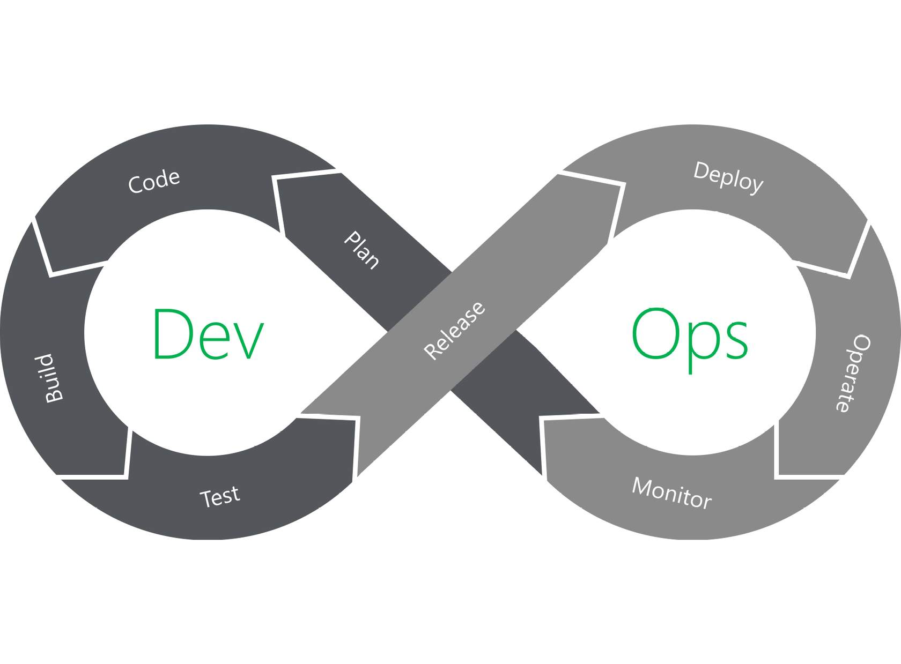

  <input type="radio" name="hotspotDevOps" id="toggle0i" checked hidden>

  

    <input type="radio" name="hotspotDevOps" id="toggle25" hidden>
    <label for="toggle25" class="hotspot-btn">0</label>
    

      

        
Smart Kick-Off Preparation

        

          <label for="toggle26" class="nav-btn">></label>
          <label for="toggle0i" class="close-btn">x</label>
        

      

      **Activities**
      

      <ul>
        <li>Review the target picture for your bounded context or domain with your Lead Architect, Enterprise Architect or Solution Architect peers</li>
        <li>Make sure you know the current strategic goals and boundary conditions for integration</li>
        <li>If in doubt, apply the following prioritization:
        

        <ul>
          <li>Business value over technical strategy 
          Do not implement an interface you do not understand (as SA you are the Design Authority). Exceptions to the technical strategy must be well justified.</li>
          <li>Strategic goals over project-specific benefits  
          Helvetia benefits more from adhering to strategic goals than from pursuing individual interests</li>
          <li>Flexibility over optimization 
          Optimization of interfaces is normal and important, but flexible interfaces can be reused more easily</li>
          <li>Evolutionary refinement over striving for initial perfection 
          As requirements change, evolution of interfaces is the normal case. Implementing assumptions that have not been met creates unnecessary extra work.</li>
        </ul>
        

        </li>
      </ul>
      

      **Roles**
      

      <ul>
        <li>Enterprise Architect</li>
        <li>Lead Architect</li>
        <li>Solution Architect</li>
      </ul>
      

      **Quality gate to complete the phase**
      

      <ul>
        <li>Ensure you have a holistic understanding of the business context, the constraints and the sponsors interest and goals.</li>
        <li>Use the Architecture Decision (ADL) as a gauge for this by deriving your solution options and making comprehensible and sustainable decisions</li>
      </ul>
      

      **TIP:**
      

      <ul>
        <li>ARC42 is very helpful but you need to invest time!</li>
        <li>Get an early understanding of the budget available for your task, this is often a difficult constraint.</li>
      </ul>
      

    

  

  

    <input type="radio" name="hotspotDevOps" id="toggle26" hidden>
    <label for="toggle26" class="hotspot-btn">1</label>
    

      

        
Kick-off

        

          <label for="toggle25" class="nav-btn"><</label>
          <label for="toggle27" class="nav-btn">></label>
          <label for="toggle0i" class="close-btn">x</label>
        

      

      **Activities**
      

      <ul>
        <li>Nominate Solution Architect & DevOps Engineer</li>
        <li>Plan and build Integration expertise for Architects and DevOps Engineer</li>
      </ul>
      

      **Roles**
      

      <ul>
        <li>PM</li>
        <li>Tech Business Partner</li>
        <li>Business Analyst</li>
        <li>Solution Architect</li>
        <li>Enterprise Architect</li>
      </ul>
      

      **Quality Gateways to complete phase**
      

      <ul>
        <li>Has a solution architect been assigned to the project?</li>
        <li>Do the architect and DevOps engineer have the required HIP know-how?</li>
        <li>Does the initiator have the budget to implement the interface?</li>
      </ul>
      

    

  

  

    <input type="radio" name="hotspotDevOps" id="toggle27" hidden>
    <label for="toggle27" class="hotspot-btn">2</label>
    

      

        
Plan & Design

        

          <label for="toggle26" class="nav-btn"><</label>
          <label for="toggle28" class="nav-btn">></label>
          <label for="toggle0i" class="close-btn">x</label>
        

      

      **Activities**
      

      <ul>
        <li>Determine FR & NFR</li>
        <li>Identify architecture domains and bounded contexts</li>
        <li>Determine the <a href="https://wiki.helvetia.group/display/HIPUD/Choosing+Integration+Pattern">HIP integration pattern(s)</a></li>
        <li><a href="https://backstage.hip.helvetia.io/">Search for APIs and identify reusable APIs</a></li>
        <li>Determine new API requirements</li>
        <li>Determine security needs e.g. authentication and authorization</li>
        <li>Design information models according to <a href="https://wiki.helvetia.group/pages/viewpage.action?pageId=512674957">Helvetia Business Data Model (BDM)</a></li>
        <li>Document solution design with detailed API specifications</li> 
        <li>Communicate API design to stakeholders for their feedback</li>
        <li>Review solution design with HIP team</li>
        <li>Draft API documented on API catalog (API contract visible on the portal)</li>
        <li>Describe API tests</li>
      </ul>
      

      **Roles**
      

      <ul>
        <li>Business Analyst</li>
        <li>Solution Architect</li>
        <li>Enterprise Architect</li>
        <li>DevOps Engineer</li>
        <li>HIP Team</li>
        <li>BDM / Data Architect</li>
      </ul>
      

      **Quality gate to complete phase**
      

      <ul>
        <li>Are the interface requirements well documented incl. system context?</li>
        <li>Do we have an approved architecture solution design?</li>
        <li>Are we using standard HIP patterns? If not, do we have an approved ADL?</li>
        <li>Will the solution use the HIP infrastructure? If not, are they validated by the Arch. Mgmt?</li>
        <li>Have DevOps engineers been assigned to the project?</li>
        <li>Have the security requirements been identified and agreed with all stakeholders?</li>
        <li>Has the solution design been reviewed?</li>
      </ul>
      

    

  

  

    <input type="radio" name="hotspotDevOps" id="toggle28" hidden>
    <label for="toggle28" class="hotspot-btn">3</label>
    

      

        
Code

        

          <label for="toggle27" class="nav-btn"><</label>
          <label for="toggle29" class="nav-btn">></label>
          <label for="toggle0i" class="close-btn">x</label>
        

      

      **Activities**
      

      <ul>
        <li>Implement API</li>
        <li>Document API (if you expose an API)</li>
        <li>Specify API characteristics (HIP self-service)</li>
      </ul>
      

      **Roles**
      

      <ul>
        <li>API Owner</li>
        <li>DevOps Engineer</li>
      </ul>
      

      **Quality Gateways to complete phase**
      

      <ul>
        <li>Is the API well documented in the API catalog?</li>
      </ul>
      

    

  

  

    <input type="radio" name="hotspotDevOps" id="toggle29" hidden>
    <label for="toggle29" class="hotspot-btn">4</label>
    

      

        
Test

        

          <label for="toggle28" class="nav-btn"><</label>
          <label for="toggle30" class="nav-btn">></label>
          <label for="toggle0i" class="close-btn">x</label>
        

      

      **Activities**
      

      <ul>
        <li>Run unit tests</li>
        <li>Run integration tests</li>
      </ul>
      

      **Role**
      

      <ul>
        <li>DevOps Engineer</li>
      </ul>
      

      **Quality Gateways to complete phase**
      

      <ul>
        <li>Are all unit tests execution successful?</li>
        <li>Have integration tests been carried out?</li>
      </ul>
      
 
    

  

  

    <input type="radio" name="hotspotDevOps" id="toggle30" hidden>
    <label for="toggle30" class="hotspot-btn">5</label>
    

      

        
Release & Deploy

        

          <label for="toggle29" class="nav-btn"><</label>
          <label for="toggle31" class="nav-btn">></label>
          <label for="toggle0i" class="close-btn">x</label>
        

      

      **Roles**
      

      <ul>
        <li>Issue GIT pull request</li>
        <li>Perform governance checks</li>
        <li>Approve GIT merge by API owner</li>
        <li>Deploy API proxy</li>
      </ul>
      

      **Roles**
      

      <ul>
        <li>DevOps Engineer</li>
        <li>HIP Team</li>
        <li>API Owner</li>
      </ul>
      

      **Quality Gateways to complete phase**
      

      <ul>
        <li>Has the integration API/flow been released for prod. deployment?</li>
        <li>Has the implementation of the integration been documented?</li>
      </ul>
      

    

  

  

    <input type="radio" name="hotspotDevOps" id="toggle31" hidden>
    <label for="toggle31" class="hotspot-btn">6</label>
    

      

        
Consume & Test

        

          <label for="toggle30" class="nav-btn"><</label>
          <label for="toggle32" class="nav-btn">></label>
          <label for="toggle0i" class="close-btn">x</label>
        

      

      **Activities**
      

      <ul>
        <li>Subscribe to the API (self-service)</li>
        <li>Comprehend the API documentation & specification for a fast and easy usage</li>
        <li>Develop API consumer application</li>
        <li>Configure Security</li>
        <li>Document interface in LeanIX (process will be automated)</li>
      </ul>
      

      **Roles**
      

      <ul>
        <li>DevOps Engineer</li>
        <li>API Owner</li>
      </ul>
      

      **Quality Gateways to complete phase**
      
 
      <ul>
        <li>Have integration tests been carried out?</li>
        <li>Are the application(s) and interface(s) documented in LeanIX?</li>
      </ul>
      

    

  

  

    <input type="radio" name="hotspotDevOps" id="toggle32" hidden>
    <label for="toggle32" class="hotspot-btn">7</label>
    

      

        
Operate

        

          <label for="toggle31" class="nav-btn"><</label>
          <label for="toggle0i" class="close-btn">x</label>
        

      

      **Activities**
      

      <ul>
        <li>iManage API lifecycle</li>
        <li>Use monitoring dashboard</li>
        <li>Tackles API alerting</li>
        <li>Troubleshooting</li>
      </ul>
      

      **Roles**
      

      <ul>
        <li>DevOps Engineer</li>
        <li>HIP Team</li>
      </ul>
      

      **Quality Gateways to complete phase**
      

      <ul>
        <li>Is the interface using the standard HIP monitoring?</li>
        <li>Is the interface using the standard HIP alerting mechanism?</li>
        <li>Is the interface using the standard HIP incident handling process?</li>
        <li>Has interface support been organized within the responsible DevOps team?</li>
      </ul>
      

    

  

  <b>NOTE</b>  
  The quality gates mentioned above are milestones in the project process where a decision is made on the release of the next process phase based on a checklist. At the end of each phase, it is decided whether the project starts the next phase or whether improvements are necessary. The focus of the quality gates are on the qualitative fulfilment and less on the time aspect.

Integration special cases

Exceptions are technology specific integrations like SAP to SAP IDOC, BAPI integrations or HOST to HOST. Nevertheless the solution architect has the responsibility to document the interface in LeanIX. 

For governance revision purpose, all the interfaces not built on the HIP platform must be reviewed by the HIP team. Before starting the development, please contact the HIP team: [#hip-integration-request](https://teams.microsoft.com/l/channel/19%3a9777e02af90640cc9573cb29a1001b79%40thread.tacv2/hip-help?groupId=ca88e69d-414d-4572-8e73-b3e1935075e0&tenantId=82bddc65-9759-44b2-af74-ec76b2e6812a) 

File Transfer

For a file transfer pattern where the HIP bulk transfer solution doesn't fit, MFT file transfer technology should be considered. In order to initiate a MFT implementation, please raise a JIRA demand or sub-demand and invite the solution architect to document the MFT solution design ([see the MFT process description](https://wiki.helvetia.group/x/XkeEDg)). 

Roles and Responsibilities

Overview

The following paragraph describes the roles and responsibilities in the context of HIP. In that context, from the highest perspective, we talk about two groups/teams: 

  <ul>
    <li>DevOps Team (or application team) The DevOps teams itself are composed of many organizational roles such as Solution Architects or DevOps Engineer. On this page, we will not cover these types of roles.</li>
    <li>HIP Team</li>
  </ul>

In the picture below, these roles are recognizable. For each role, the responsibility is also listed. More details about the responsibilities of both roles are listed below. 

The illustration also shows an exemplary usage of HIP APIs. As HIP provides a series of Self-Services, that allow for the configuration, provisioning and use of APIs. In the context of HIP, the following technology resources are all called APIs: Kafka Topics, HTTP APIs as well as S3 Buckets.

  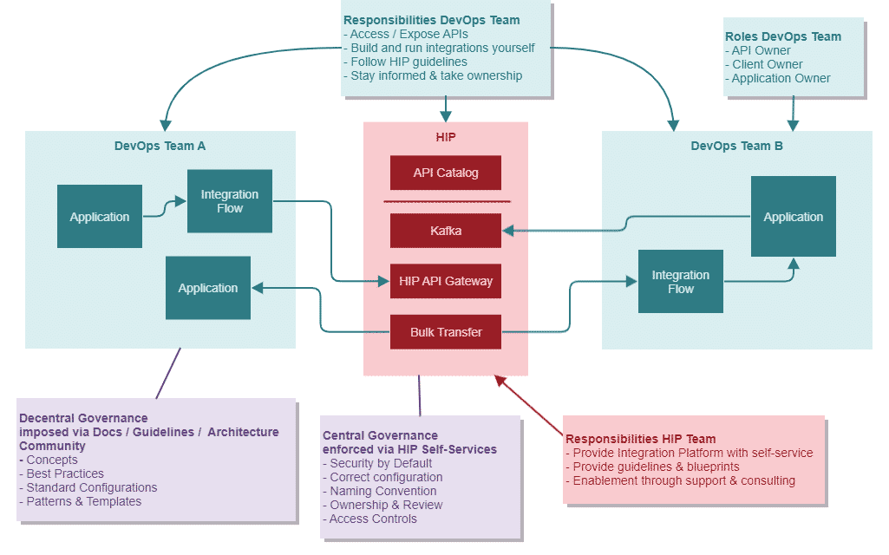

  <input type="radio" name="hotspotRoles" id="toggle0j" checked hidden>

  

    <input type="radio" name="hotspotRoles" id="toggle33" hidden>
    <label for="toggle33" class="hotspot-btn">+</label>
    

      

        
DevOps Team

        

          <label for="toggle34" class="nav-btn">></label>
          <label for="toggle0j" class="close-btn">x</label>
        

      

      The DevOps team or Application team is the group of architects and developers that are responsible for developing and operating an application. In the context of HIP, they: 
      

      <ul>
        <li>expose APIs on HIP</li>
        <li>access APIs on HIP</li>
      </ul>
      
 
      The DevOps Team is responsible for designing, implementing and running their Integrations (not the integration infrastructure, though), following HIP Guidelines and staying informed on changes and developments of HIP.
    

  

  

    <input type="radio" name="hotspotRoles" id="toggle34" hidden>
    <label for="toggle34" class="hotspot-btn">+</label>
    

      

        
The HIP Team

        

          <label for="toggle33" class="nav-btn"><</label>
          <label for="toggle35" class="nav-btn">></label>
          <label for="toggle0j" class="close-btn">x</label>
        

      

      The HIP Team is responsible for developing and operating the HIP Infrastructure and Self-Service Processes. They are not responsible for implementing and maintaining custom integration components and configurations. This activity is shifted to the consumers and producers of Data and Services. 
      The HIP Team is responsible for creating & maintaining documentation, guidelines, blueprints & best practices.  
      The HIP Team provides Consulting, Implementation and Operations (3rd Level) Support.
    

  

  

    <input type="radio" name="hotspotRoles" id="toggle35" hidden>
    <label for="toggle35" class="hotspot-btn">+</label>
    

      

        
Roles DevOps Team

        

          <label for="toggle34" class="nav-btn"><</label>
          <label for="toggle36" class="nav-btn">></label>
          <label for="toggle0j" class="close-btn">x</label>
        

      

      **API Owner** 
      The API Owner is a human and is responsible for:
      

      <ul>
        <li>exposed API on the HIP platform</li>
        <li>reviewing Self-Service requests by clients to access the API </li>
        <li>stewardship of data exposed via API in accordance with data owner</li>
        <li>managing the API Lifecycle (versioning, deprecation, data retention policy)</li>
      </ul>
      
 
      **Client Owner** 
      The Client represents an entity, which accesses an API, typically an application. 
      The Client Owner is responsible for: 
      

      <ul>
        <li>accessing APIs via HIP Platform</li> 
        <li>transforming the data into a form and format that is usable for them</li>
        <li>providing sufficient information when submitting Self-Service Request</li> 
        <li>ensuring data privacy of consumed APIs (In case of questions, reach out to the Data Protection Department for additional guidance.)</li>  
        <li>Reviewing and approving Self-Service Requests to the client configurations in HIP</li>
      </ul>
      

      **Application Owner** 
      For some Self-Services, the Application Owner (LeanIX Application Owner (technical)) has to approve APIs exposed for their application.
    

  

  

    <input type="radio" name="hotspotRoles" id="toggle36" hidden>
    <label for="toggle36" class="hotspot-btn">+</label>
    

      

        
Governance Controls

        

          <label for="toggle35" class="nav-btn"><</label>
          <label for="toggle0j" class="close-btn">x</label>
        

      

      The last piece of information depicted in the diagram is about governance controls. HIP is built with high automation standards. This allows to enforce governance automatically at the self-service in a central location. On the other hand, HIP offers a wide range of guidance to the DevOps teams that shall help to establish a decentral governance. The DevOps teams are responsible to comply here.
    

  

Self-service

When we show up to the present moment with all of our senses, we invite the world  
to fill us with joy. The pains of the past are behind us. The future has yet to unfold. But  
the now is full of beauty simply waiting for our attention.

What self-service functions are available?

The Helvetia Integration Platform (HIP) makes it possible to provide new integrations quickly and easily via a self-service process. In addition to traditional APIs such as REST and SOAP, HIP also includes Kafka for asynchronous event streaming and Bulk Transfer for sending large amounts of data.

Based on the integration technology and its constraint, we have to work with different self-service practices:

  

    <table class="DO-table">
      <thead>
        <tr>
          <th>Integration Objects</th>
          <th>Type of demand and Link to User Documentation Page</th>
          <th>Comment</th>
        </tr>
      </thead>
      <tbody>
        <tr>
          <td>HCP Services</td>
          <td><a href="https://wiki.helvetia.group/display/HVCPFDV/HCP+Services">HCP Services</a></td>
          <td>HCP Namespaces and more</td>
        </tr>
        <tr>
          <td>Manage HTTP API (SOAP or REST)</td>
          <td>
            <a href="https://wiki.helvetia.group/display/HIPUD/Expose+HTTP+API">Expose HTTP API</a> 
            <a href="https://wiki.helvetia.group/display/HIPUD/Subscribing+to+an+HTTP+API">Subscribing to an HTTP API</a>
          </td>
          <td>one resource file for all stages</td>
        </tr>
        <tr>
          <td>Manage Kafka Connect Connector</td>
          <td><a href="https://wiki.helvetia.group/display/HIPUD/Self-Service%3A+Using+the+Self-Service">Self-Service: Using the Self-Service</a></td>
          <td>one resource file per stage</td>
        </tr>
        <tr>
          <td>Manage Kafka topic and user</td>
          <td><a href="https://wiki.helvetia.group/display/HIPUD/Self-Service%3A+Using+the+Self-Service">Self-Service: Using the Self-Service</a></td>
          <td>one resource file per stage</td>
        </tr>
        <tr>
          <td>New AKHQ Kafka Monitoring</td>
          <td><a href="https://wiki.helvetia.group/display/HIPUD/Use+of+AKHQ">Use of AKHQ</a></td>
          <td>one demand per stage (only DEVL and INTG possible) one user resource file per stage</td>
        </tr>
        <tr>
          <td>New Kafka Connect Cluster</td>
          <td><a href="https://wiki.helvetia.group/display/HIPUD/Self-Service%3A+Kafka+Connect+Cluster">Self-Service: Kafka Connect Cluster</a></td>
          <td>one demand per stage</td>
        </tr>
        <tr>
          <td>New Kafka Connector plugin</td>
          <td><a href="https://wiki.helvetia.group/display/HIPUD/Self-Service%3A+Kafka+Connectors">Self-Service: Kafka Connectors</a></td>
          <td>one demand per Kafka connect image</td>
        </tr>
        <tr>
          <td>New S3 Bucket</td>
          <td><a href="https://wiki.helvetia.group/display/HIPUD/S3+Self+Service">S3 Self Service</a></td>
          <td>one demand for all stages</td>
        </tr>
        <tr>
          <td>Request new CDC Kafka Topic</td>
          <td><a href="https://wiki.helvetia.group/display/HIPUD/Self-Service%3A+Requesting+new+CDC+Topics">Self-Service: Requesting new CDC Topics</a></td>
          <td>one demand per stage</td>
        </tr>
      </tbody>
    </table>
  

 

  <b>RELATED INFORMATION</b> 
  

    <ul>
      <li>[What dev tools does HIP offer?](https://wiki.helvetia.group/pages/viewpage.action?pageId=783582763) (HIP User Documentation)</li> 
      <li>[What self-service functions are available?](https://wiki.helvetia.group/pages/viewpage.action?pageId=577144052) (HIP User Documentation)</li> 
      <li>[How do I test my integrations?](https://wiki.helvetia.group/pages/viewpage.action?pageId=487723938) (HIP User Documentation)</li> 
    </ul>
  

Consulting & Support

While you are responsible for your integrations, the HIP experts support your projects with hands-on guidance and advice: 

  Integration Architecture

  <ul>
    <li>Do you need a review of your integration solution design? </li> 
    <li>Do you need help choosing the right pattern for your integration?</li>
    <li>Do you think HIP does not fit for your purpose?</li>
  </ul>

 
Please contact us on Teams: 
#hip-integration-request

  Technical Support

  Do you have any technical issue in connection with HIP that you weren't able to solve after you consulted our FAQ page or this documentation? 
  Please let us know on Teams
    

  <table class="custom-table">
    <tr>
      <td>#hip-info</td>
      <td>
        Stay tuned what happens in HIP! Subscribe to keep informed about:
        

        <ul>
          <li>release notes for new features</li>
          <li>planned outages</li>
          <li>blog stories</li>
        </ul>
        

      </td>
    </tr>
    <tr>
      <td>#hip-help</td>
      <td>
        Get technical help on HIP integration provided by the community here. Note that the questions asked on this channel are answered by the community and do not contain any SLA terms.
      </td>
    </tr>
  </table>

  Organisational Support

  <ul>
    <li>Do you need an implementation partner to speed up your project? We are happy to help you to find a suitable partner with HIP know-how.</li>
    <li>Do you have problems ensuring the required operation of the interfaces? We can help you build the required structures and provide further solutions.</li>
  </ul>

 
  Please contact us on Teams:  
  

  <ul>
    <li>[#hip-help](https://teams.microsoft.com/l/channel/19%3a9777e02af90640cc9573cb29a1001b79%40thread.tacv2/hip-help?groupId=ca88e69d-414d-4572-8e73-b3e1935075e0&tenantId=82bddc65-9759-44b2-af74-ec76b2e6812a)</li>
    <li>[#hip-info](https://teams.microsoft.com/l/channel/19%3ae5fe49550fea42afaa7961eef221fd77%40thread.tacv2/hip-info?groupId=ca88e69d-414d-4572-8e73-b3e1935075e0&tenantId=82bddc65-9759-44b2-af74-ec76b2e6812a)</li>
  </ul>

# Conclusion

Congratulations!

  

  ---

  

      You are now a HIP Explorer!   
      We are glad you took your first steps into the new world of Helvetia Integration Platform with us.
  

Further Learning Paths

The learning path you have just completed is not the only learning path at HCP & HIP Academy.  
In fact, we have an entire competency model!  
If you would like to continue your education, please take a closer look at the HCP & HIP Role-based Learning Paths matrix.  

You can always find more learning paths on
<a href="https://helvetiasc.plateau.com/learning/user/personal/landOnPortalHome.do?OWASP_CSRFTOKEN=GS3A-R1OG-RKFR-36HI-5TEV-BEU3-00SK-UI9N&fromSF=Y&fromDeepLink=true&pageID=" 
   target="_blank" 
   rel="noopener noreferrer">
  Learning@Helvetia
</a>.
We look forward to welcoming you to one of our other learning paths in the near future.  
Until then – happy learning!  

Your HCP & HIP Academy Team  

**E-Mail:** 
<a href="mailto:hcp-and-hip-academy@helvetia.ch">
  hcp-and-hip-academy@helvetia.ch
</a>

 

**Slack:** #hcp-and-hip-academy

 

**Wiki:** [Landing Page](https://wiki.helvetia.group/x/u4rmFw)

 

Möchtest du uns deine Eindrücke zum HIP Explorer mitteilen?  
Hilf uns, noch besser zu werden.  
Lernpfad schnell und direkt per [Feedback-Formular](https://forms.office.com/Pages/ResponsePage.aspx?id=Zdy9glmXskSvdOx2suaBKvO-3741Yu9GrVnFpjUjAbRUQkhRTzdPTjM4RUVDWjFPR0g2TUwwNTZNUCQlQCN0PWcu) bewerten! 🧠🌟

::: continue[COMPLETE]
Complete the content above before moving on.
:::